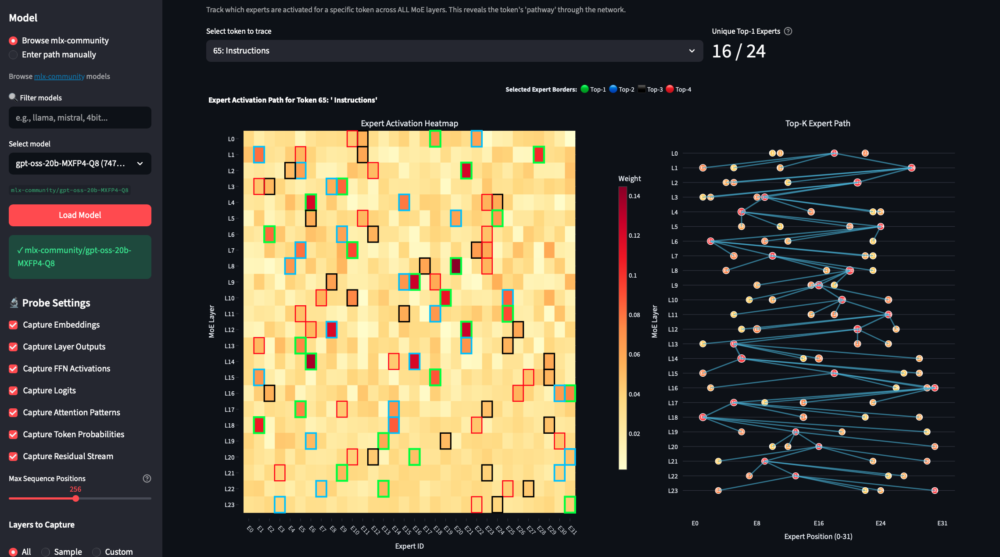
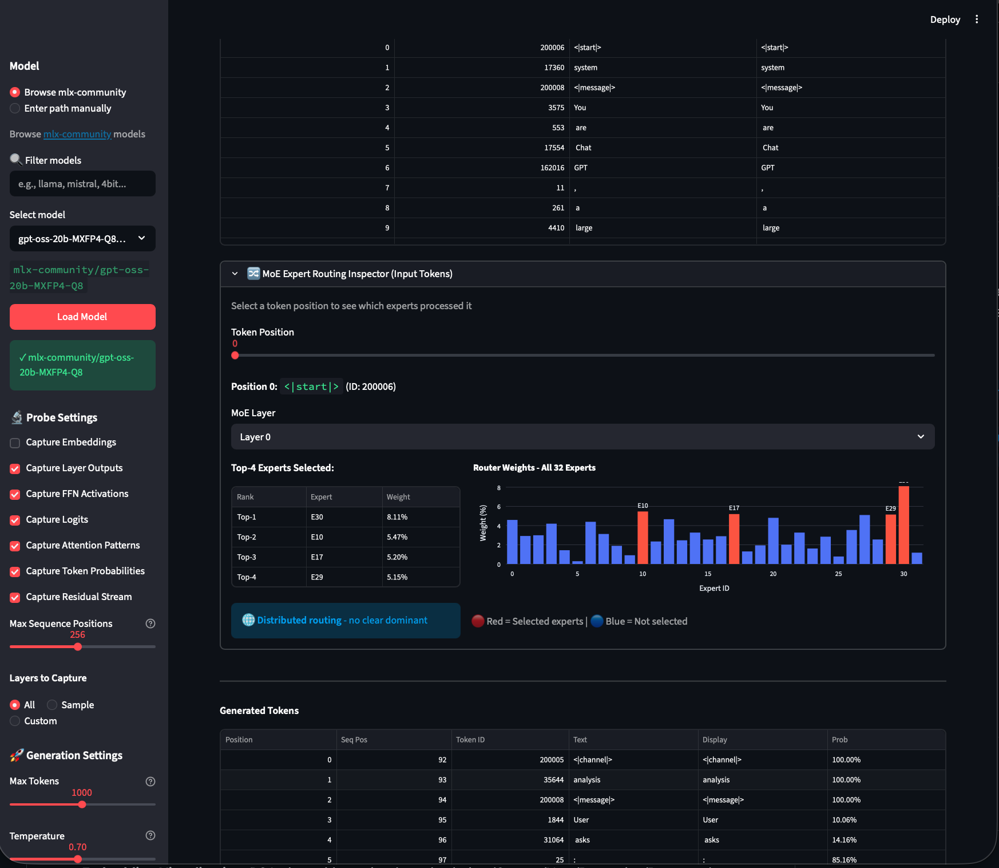
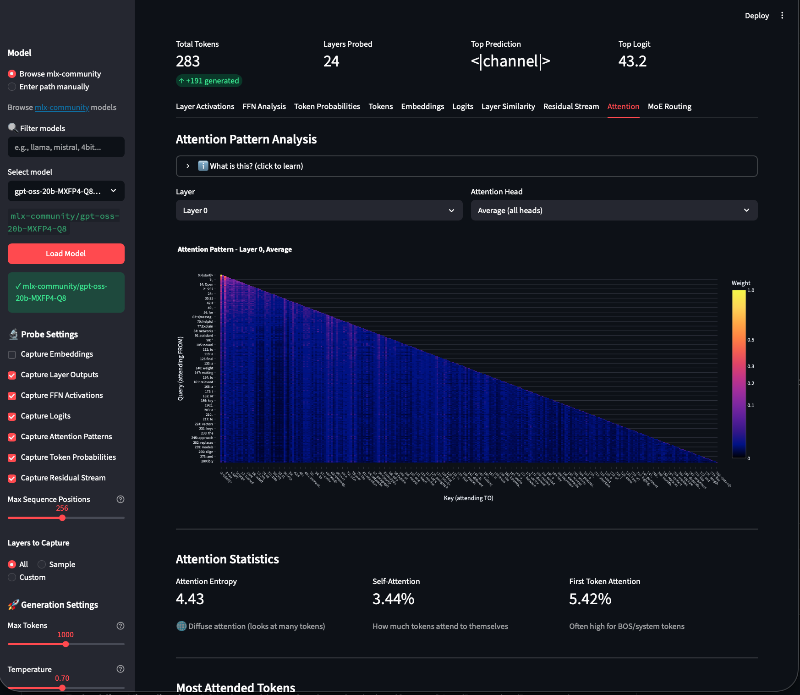
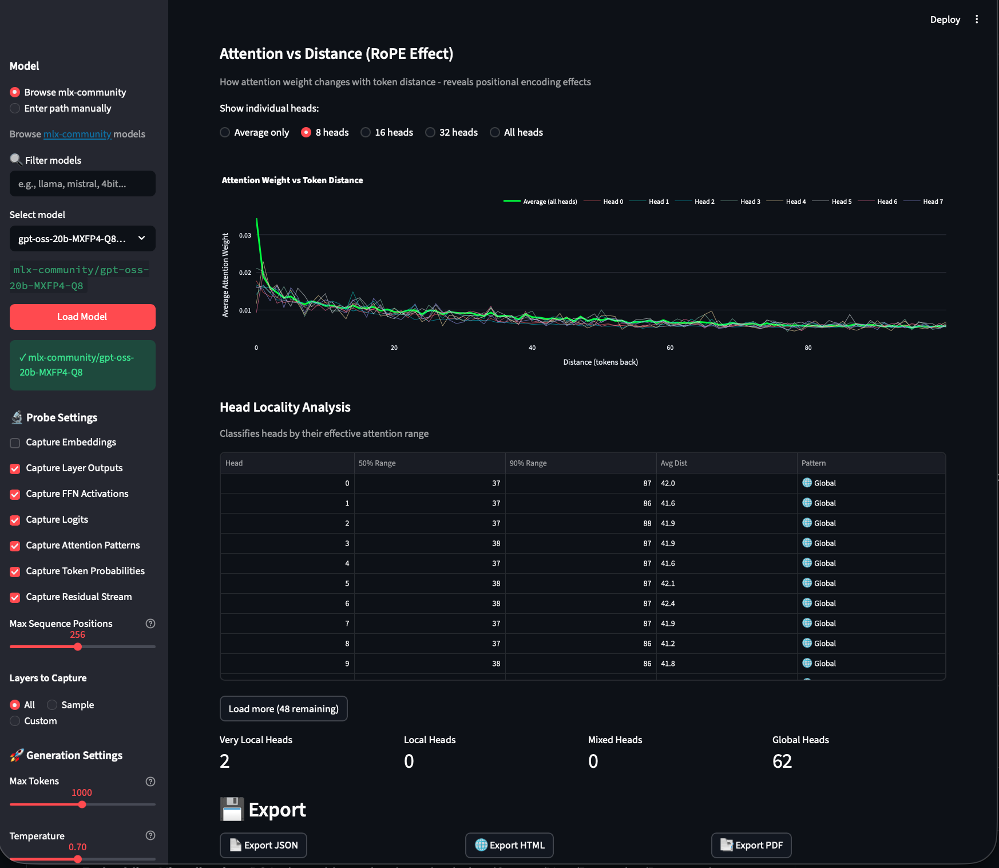
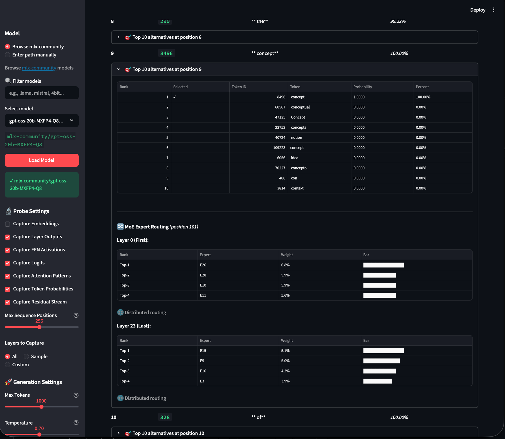

# MLXLMProbe

A visual probing and interpretability tool for MLX language models on Apple Silicon.

```bash
pip install mlxlmprobe
mlxlmprobe
```

> **Status:** Work in Progress - Currently testing with GPT-OSS and other MoE models

## Features

- **Universal MLX-LM Support**: TESTED ONLY on GPT-OSS so far
- **MoE Analysis**: Mixture-of-Experts routing visualization, expert load distribution, top-k selection patterns
- **Layer Analysis**: Visualize activation norms and patterns across all layers
- **FFN Analysis**: Gate sparsity and activation patterns in feed-forward networks
- **Embedding Visualization**: PCA plots with section-based coloring (System/User/Reasoning/Response)
- **Logits Analysis**: Token probability distributions with histograms
- **Layer Similarity**: Cosine similarity heatmaps between layer representations
- **Residual Stream**: Track information flow through the transformer
- **Token Alternatives**: See what other tokens the model considered at each position
- **Reasoning Model Support**: Detects and separates reasoning loops from final responses
- **AI Interpretation**: Optional AI-powered analysis using local model or Claude
- **Export**: PDF reports and interactive HTML exports

### Deep token MoE tracing



### Deep dive into MoE on a per token and per layer basis



### Attention pattern analysis



### RoPE Analysis



### Deep Response and Input Sequence Token Analysis



## Requirements

- **Mac with Apple Silicon** (M1, M2, M3, M4, or later)
- **macOS 15.0+** (Sequoia or later recommended)
- **8GB+ unified memory** (16GB+ recommended for larger models, 32GB+ for 30B+ models)

## Installation

```bash
pip install mlxlmprobe
```

To upgrade:
```bash
pip install --upgrade mlxlmprobe
```

### Switching from Homebrew

If you previously installed via Homebrew, switch to pip for easier updates:

```bash
brew uninstall mlxlmprobe
pip install mlxlmprobe
```

### From Source

```bash
git clone https://github.com/scouzi1966/MLXLMProbe.git
cd MLXLMProbe
pip install -r requirements.txt
streamlit run mlxlmprobe.py
```

## Quick Start

1. Run `mlxlmprobe` - the UI opens in your browser at `http://localhost:8501`
2. Select a model from the sidebar (or enter a HuggingFace model ID)
3. Enter a prompt and click "Run Probe"
4. Explore the analysis tabs

### Load a Model

**Option A: Use the sidebar to enter a HuggingFace model ID**

Popular MLX models from [mlx-community](https://huggingface.co/mlx-community):

- `mlx-community/gpt-oss-20b-MXFP4-Q8` (TESTED)
- `mlx-community/Llama-3.2-3B-Instruct-4bit` (small, fast)
- `mlx-community/Mistral-7B-Instruct-v0.3-4bit` (good quality)
- `mlx-community/Mixtral-8x7B-Instruct-v0.1-4bit` (MoE model)
- `mlx-community/Qwen2.5-7B-Instruct-4bit` (multilingual)
- `mlx-community/DeepSeek-R1-Distill-Qwen-7B-4bit` (reasoning model)

**Option B: Specify model on command line**

```bash
mlxlmprobe -- --model mlx-community/Llama-3.2-1B-Instruct-4bit
```

**Option C: Use a local model path**

```bash
mlxlmprobe -- --model /path/to/your/mlx-model
```

## Usage Guide

### Basic Workflow

1. **Enter a prompt** in the text area
2. **Click "Run Probe"** to generate and analyze
3. **Explore tabs**: Layer Activations, FFN Analysis, Tokens, Embeddings, Logits, etc.
4. **For MoE models**: Check the "MoE Routing" tab for expert analysis

### Understanding MoE Visualizations

For Mixture-of-Experts models (like Mixtral), the MoE tab shows:

- **Top-K Expert Weights**: Stacked bars showing which experts were selected
  - 🟡 Gold = Top-1 (highest weight)
  - 🟣 Magenta = Top-2
  - 🔵 Cyan = Top-3
  - 🟠 Orange = Top-4
  - Bar length = router probability assigned to that expert
  - Labels inside bars = Expert ID (E0, E1, etc.)

- **Expert Load**: How many tokens each expert processed
- **Router Probabilities**: Heatmap of all expert weights

### Command Line Options

```bash
mlxlmprobe -- --help

Options:
  --model PATH         Path or HuggingFace ID of MLX model
  --port PORT          Streamlit port (default: 8501)
  --max-tokens N       Maximum tokens to generate (default: 100)
  --max-context N      Maximum context length (default: model's max)
```

### Keyboard Shortcuts

- `Ctrl+Enter` / `Cmd+Enter` - Run probe
- `R` - Refresh page

## Troubleshooting

### "No module named 'mlx'"
MLX only works on Apple Silicon Macs. Verify with `uname -m` (should be `arm64`).

### Model download fails
- Check internet connection
- Verify the model ID exists on HuggingFace
- Try a smaller model first

### Out of memory
- Try a smaller/more quantized model (4bit instead of 8bit)
- Reduce max tokens to generate
- Close other applications

### Streamlit won't start
```bash
# Kill any existing Streamlit processes
pkill -f streamlit

# Try a different port
mlxlmprobe --server.port 8502
```

## How It Works

MLXLMProbe intercepts the forward pass of transformer models to capture:

1. **Embeddings**: Initial token representations
2. **Layer Outputs**: Hidden states after each transformer block
3. **FFN/MoE Activations**: Gate values and expert routing decisions
4. **Final Logits**: Output distribution over vocabulary
5. **Per-token Alternatives**: What other tokens were considered

These are visualized using Plotly for interactive exploration.

## License

MIT License - see LICENSE file for details.

## Acknowledgments

- Built on [MLX](https://github.com/ml-explore/mlx) by Apple
- Uses [mlx-lm](https://github.com/ml-explore/mlx-examples) for model loading
- Inspired by transformer interpretability research

## Contributing

This is a work in progress. Issues and PRs welcome!
